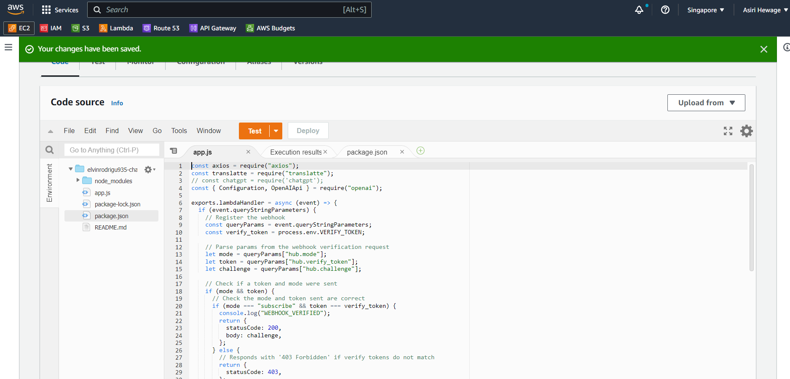
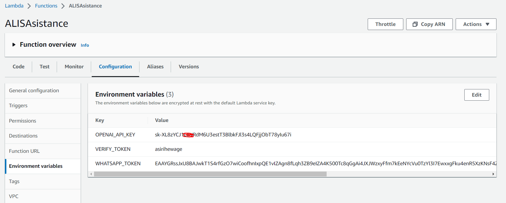
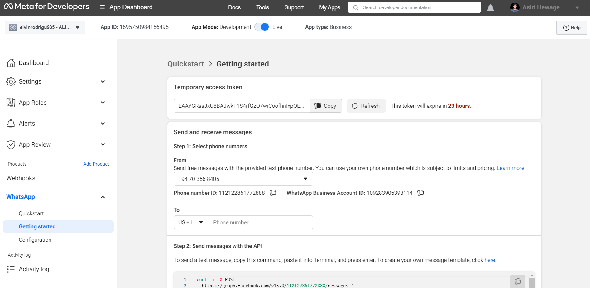

# ALIS Assistance

## Installation
- Create a Lambda Function on AWS and upload the project as a zip file
- Setup AWS Lambda environment variables
- Create a Facebook app and include WhatsApp integration
- verify webhook with verify token
- update WhatsApp token in Lambda variables
- Register mobile numbers and a business account for WhatsApp Bot.
- Wait for mobile number verification.
- Start sending messages.

## Tech Stack

- Npm i (Node version 14)
- AWS Lambda
- MongoDB
- WhatsApp API

# AWS Lambda Dunction

# Meta Account configurations

## License

[MIT](https://choosealicense.com/licenses/mit/)